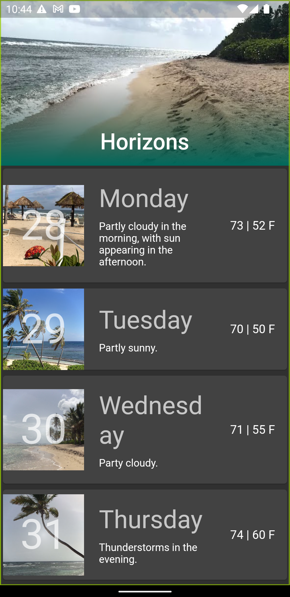

# slivers

A Flutter project for understanding slivers.

## Reference
[Using slivers to achieve fancy scrolling](https://docs.flutter.dev/development/ui/advanced/slivers)

## Widgets Used

- SliverAppBar
- SliverToBoxAdapter
- SliverPadding
- SliverGrid
- SliverList

## App Screenshot

